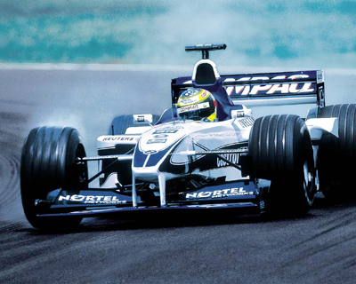



## Image utils

### Description

This is a dll I wrote. You can get desktop(in bmp or jpg), You can convert BMPtoJPG or JPGtoBMP, You can RotateLeft, RotateRight and You can make Grayscale a picture with it.

I have included the dll Source code. Enjoy.
 
### More Info
 

             |
---                |---
**Submitted On**   |2000-08-04 15:09:44
**By**             |[Puskai Zoltan](https://github.com/Planet-Source-Code/PSCIndex/blob/master/ByAuthor/puskai-zoltan.md)
**Level**          |Beginner
**User Rating**    |4.5 (36 globes from 8 users)
**Compatibility**  |VB 5\.0, VB 6\.0
**Category**       |[Graphics](https://github.com/Planet-Source-Code/PSCIndex/blob/master/ByCategory/graphics__1-46.md)
**World**          |[Visual Basic](https://github.com/Planet-Source-Code/PSCIndex/blob/master/ByWorld/visual-basic.md)
**Archive File**   |[CODE\_UPLOAD8599842000\.zip](https://github.com/Planet-Source-Code/puskai-zoltan-image-utils__1-10390/archive/master.zip)

